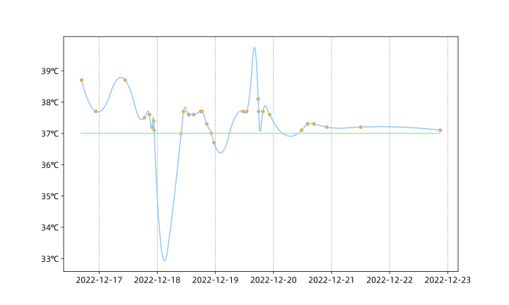

# COVID-19 感染记录

## 1 第一天 20221215

### 下午

嗓子干

### 晚上

嗓子干，嗓子疼

## 2 第二天 20221216

### 上午

没有上午，睡到十一点半

### 下午

午饭果然没有食欲

开始发冷，有一阵一阵的恶寒，喉咙更疼了。吃了几片复方青橄榄利咽含片。

脸上烧，脖子以下发冷。

冰糖金桔罐头泡水嚯。

脸上烧呼呼的 ┭┮﹏┭┮

16:45 38.7 布洛芬

18:00-21:30 睡觉觉

22:00 次饭饭：肉末茄子好好次  有点点冒虚汗

22:39 37.7

吃了风寒感冒颗粒

## 3 第三天 20221217

### 上午

昨晚上睡得好难受 醒了很多次 呜呜呜

10:46 38.7

12:00 布洛芬缓释胶囊

### 下午

13:00-16:30 睡觉觉 睡得好舒服啊 这几天第一次这么舒服

### 晚上

大肉片子好好吃

18:45 37.5

20:45 37.6

## 4 第四天 20221218

### 上午

挺好的 昨晚上至少睡得比较舒服

喉咙不痛了 脑壳有点痛有点晕 眼睛转着疼 还是在流鼻涕

九点半起床 呕吐了两次 没有东西吐

嚯了个藿香正气口服液

### 下午

嚯了蔬菜粥 居然真丧失味觉 粥发苦发闲

还在低烧 受不了了 嚯完稀饭吃布洛芬

18:09 布洛芬

### 晚上

那么好吃的尤卤 居然发苦？还是撒点醋好次诶

买了个暖水袋 <(*￣▽￣*)/

## 5 第五天 20221219

低烧

结膜炎

两包风寒感冒颗粒

受不了了啊 喝不动水了 yue~~~

## 6 第六天 20221220

还是鼻塞

口腔溃疡

低烧

## 7 第七天 20221221

感觉好多了

正常流鼻涕但不太堵了

口腔溃疡

眼睛轻微不适

低低烧

## 8 第八天 20221222

几乎不怎么流鼻涕了

口腔溃疡变轻了

其他症状无

## 体温检测

|       时间       | 体温 |
| :--------------: | :--: |
| 2022-12-16 16:45 | 38.7 |
| 2022-12-16 22:39 | 37.7 |
| 2022-12-17 10:46 | 38.7 |
| 2022-12-17 18:45 | 37.5 |
| 2022-12-17 20:45 | 37.6 |
| 2022-12-17 21:55 | 37.2 |
| 2022-12-17 22:33 | 37.4 |
| 2022-12-17 22:43 | 37.1 |
| 2022-12-18 09:52 | 37.0 |
| 2022-12-18 10:52 | 37.7 |
| 2022-12-18 13:00 | 37.6 |
| 2022-12-18 13:11 | 37.6 |
| 2022-12-18 15:03 | 37.6 |
| 2022-12-18 17:57 | 37.7 |
| 2022-12-18 18:30 | 37.7 |
| 2022-12-18 20:28 | 37.3 |
| 2022-12-18 22:20 | 37.0 |
| 2022-12-18 23:28 | 36.7 |
| 2022-12-19 11:29 | 37.7 |
| 2022-12-19 13:00 | 37.7 |
| 2022-12-19 17:41 | 38.1 |
| 2022-12-19 17:52 | 37.7 |
| 2022-12-19 19:40 | 37.7 |
| 2022-12-19 22:26 | 37.6 |
| 2022-12-20 11:40 | 37.1 |
| 2022-12-20 14:04 | 37.3 |
| 2022-12-20 16:46 | 37.3 |
| 2022-12-20 22:00 | 37.2 |
| 2022-12-21 12:02 | 37.2 |
| 2022-12-22 20:52 | 37.1 |

